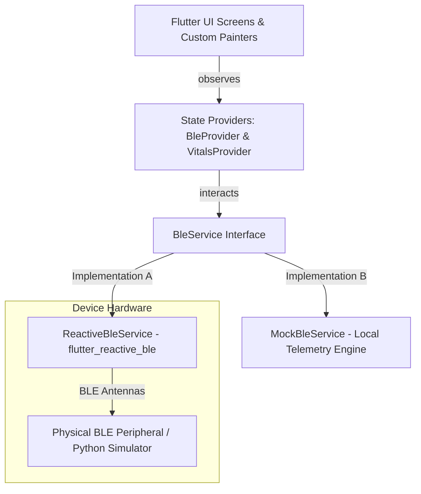

# Assignment Submission: BLE Vitals Scanner

This document contains the submission details, technical architecture, and verification instructions for the BLE Vitals Scanner Flutter application and peripheral simulator assignment.

---

## 📋 Candidate Information

*   **Candidate Name:** Kavitha R
*   **Email Address:** [kavitharamesh1408@gmail.com](mailto:kavitharamesh1408@gmail.com)
*   **Applied Role:** Flutter Intern
*   **Assignment Name:** BLE Vitals Scanner (Orbytring Premium White Theme Edition)
*   **Submission Date:** May 29, 2026

---

## 🔍 Executive Project Summary

The **BLE Vitals Scanner** is a high-fidelity Flutter application built specifically to discover, connect to, and stream data from Bluetooth Low Energy (BLE) vital sign monitors. 

To honor the design language of **Orbytring** (sensio), the entire application has been styled in a premium **Orbyt White Theme** utilizing signature champagne and rose gold tones from [orbytring.com](https://www.orbytring.com). 

The application offers an integrated experience containing:
1.  **Dynamic Onboarding & Permissions Gate**: Gracefully guides the user to grant Bluetooth and Location permissions depending on their Android SDK level.
2.  **Visual Radar Scanning**: A high-performance canvas-based circular sweeping radar graphic showing real-time RSSI signal strength and service advertisements.
3.  **GATT Services Explorer**: Discovers and translates standard GATT SIG hexadecimal service and characteristic IDs into readable labels.
4.  **Live Telemetry Dashboard**: Subscribes to the Heart Rate Service characteristic (`0x2A37`), continuously parsing incoming raw binary packet flags to compute real-time BPM values.
5.  **ECG Bezier Charting**: Continuously scrolls a real-time vector Bezier curve waveform plotting live heart rates on a clinical grid canvas.
6.  **Dual BLE Testing Architecture**: Operates on real physical BLE radios utilizing `flutter_reactive_ble` or swaps instantly into an in-app software simulator (ideal for headless android emulators).
7.  **External BLE Python Simulator**: Includes a separate, fully functioning PC-side peripheral simulator leveraging `bless` and `bleak` libraries to advertise and stream heart rate data.

---

## 🎨 Design & Aesthetic System

Styled around the official Orbyt Smart Ring aesthetic, the app relies on a carefully selected palette of HSL-tailored branding tones:

| Design Token | Color Hex | Color Name | Application Area |
| :--- | :--- | :--- | :--- |
| **Canvas Background** | `#F8FAFC` | Metallic White | Main application backgrounds and screen foundations |
| **Surface Cards** | `#FFFFFF` | Pure White | Elevational card surfaces, borders, and controls |
| **Signature Gold** | `#C5A059` | Champagne/Auric Gold | Radar sweep, connection buttons, switches, and primary branding icons |
| **Vital Rose Gold** | `#D49A8F` | Orbyt Rose Gold | Pulser heart indicators, live ECG lines, and critical status labels |
| **Primary Text** | `#0F172A` | Stellar Black | High-contrast headers and bold titles |
| **Secondary Text** | `#64748B` | Gunmetal Slate | Descriptive secondary notes and technical parameters |
| **Dividers & Borders** | `#E2E8F0` | Steel Silver | Subtle gridlines and card outlines |

---

## 🏗️ Technical Architecture & Decoupling

The codebase has been engineered following clean architecture principles, separating user interfaces from direct platform drivers:



### File Hierarchy & Component Map

*   `lib/main.dart`: Global MultiProvider bindings and dynamic onboarding gateways.
*   `lib/core/theme/app_theme.dart`: Premium Light-Theme definitions and text styling.
*   `lib/core/constants/ble_constants.dart`: Unified BLE GATT SIG Service and Characteristic lookup descriptors.
*   `lib/core/utils/permission_helper.dart` & `lib/presentation/screens/permissions_screen.dart`: Dynamic cross-SDK version permission handlers.
*   `lib/data/ble/ble_service.dart`: Repository interface decoupled from native drivers.
*   `lib/data/ble/reactive_ble_service.dart`: Physical hardware driver managing scans and notify streams via `flutter_reactive_ble`.
*   `lib/data/ble/mock_ble_service.dart`: Complete offline software simulator matching RSSI and vital rates for emulators.
*   `lib/logic/ble_provider.dart` & `vitals_provider.dart`: Business logic providers controlling scanning, handshakes, and parsing raw binary packages (GATT `0x2A37`).
*   `lib/presentation/widgets/`:
    *   `pulse_radar.dart`: Custom-painted radar sweep graphic.
    *   `vitals_chart.dart`: Continuous scrolling ECG-like Bezier waveform.
    *   `device_card.dart`: Gold-accented Bluetooth metadata cards.
*   `lib/presentation/screens/`:
    *   `scan_screen.dart`: Main scanner screen with mock switch toggles.
    *   `details_screen.dart`: GATT terminal logs, connection info, and clinical live monitor.
*   `simulator/ble_simulator.py`: Python BLE peripheral broadcasting heart rates via `bless` and `bleak`.

---

## 🛠️ Verification & Run Instructions

All code has been validated utilizing static compiler analyzers and runs warning-free.

### 📦 Submission Deliverables

*   **Release APK Location:** `d:\projects\orbytring\build\app\outputs\flutter-apk\app-release.apk` (44.2MB).
*   **Source Code Repository:** Main Flutter module and Python BLE peripheral simulator.

### How to Run the App Locally

1.  **Clone / Fetch project source files**.
2.  **Resolve dependencies**:
    ```bash
    flutter pub get
    ```
3.  **Run static analysis checks (100% warning-free)**:
    ```bash
    flutter analyze
    ```
4.  **Run the unit and widget smoke tests**:
    ```bash
    flutter test
    ```
5.  **Compile & run on a connected emulator or real phone**:
    ```bash
    flutter run --release
    ```

### How to Run the Python BLE Simulator

If you are using a real Android phone and your computer supports a Bluetooth transceiver:
1.  Open a terminal or developer prompt on your computer.
2.  Navigate to the simulator directory and install prerequisites:
    ```bash
    cd d:/projects/orbytring/simulator
    python -m pip install bless bleak
    ```
3.  Execute the simulator script:
    ```bash
    python ble_simulator.py
    ```
4.  The terminal will print: `Advertising as 'Orbytring Vitals Sim'. Awaiting connections...`.
5.  Toggle off **Simulator Mode** in the Flutter app, and scan for the physical PC peripheral broadcast.
